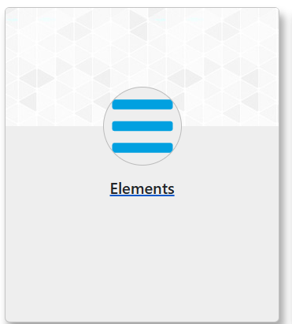
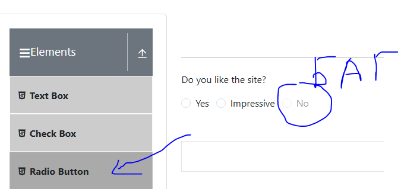

## Bug report number 1!

### Номер версии сайта:
14.88
### Критичность бага:
s3 (Значительный)
### Приоретет:
P2 Средний
### Важные замечания для разработчиков

### Статус
открыт
### Создатель баг репорта:
Шишов ДС
### Назначен на:
Учительность
### Описание:
Когда сайт спрашивает пользователя о том, нравится ли ему сайт невозможно нажать нет.
### Путь до бага:

